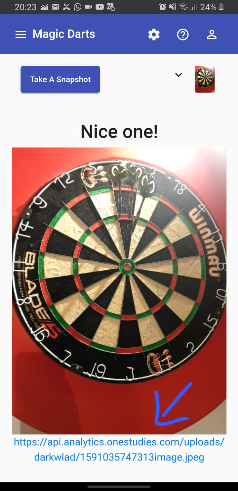

# Capture Darts Scores

This app is accessing the camera through the browser in order to take photos and upload them to a server.
The idea and use case behind the app is to be able to do image processing on the server side.

A further repository will be linked here once it is created with the purpose of analyzing darts scores.

This is a sample photo from a dartboard (taken through the angular app):

## How to setup the project:

### Client
* open the angular-app folder in a terminal
* type `npm install` to install the dependencies
* run the dev server using `ng serve`
* open http://localhost:4200 in your browser

### API
(setting up the api is not necessary in order to run the client app)
* first make sure you have a MongoDB server configured which matches the config file under: `api/config/db.js`
* open the api folder in a terminal
* type `npm install` to install the dependencies
* to run the node server, either:
    * type `node bin/www`
    * or use nodemon: `nodemon bin/www`

## Configure the project:

### Client
* variables stored in `angular-app/src/app/shared/store/variables.ts`
    * `api` configures the api endpoint: select http://localhost:3000/ if you have your api server running on localhost

### API
* database config file: `api/config/db.js`

